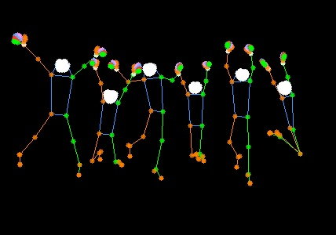

Sure, here is the English version of the README:

---

## Introduction

[简体中文](README_CN.md) | English

This project is based on [MMPOSE](https://github.com/open-mmlab/mmpose.git). For more examples, please refer to [MMPOSE demos](https://mmpose.readthedocs.io/en/latest/demos.html).

## CUDA Installation
Skip this step if you have already installed Anaconda3.

```shell
wget https://repo.anaconda.com/archive/Anaconda3-2021.05-Linux-x86_64.sh

bash Anaconda3-2021.05-Linux-x86_64.sh

source ~/.bashrc
```

Test if the installation was successful
```
conda list
```
Please note to replace the Anaconda3 installation script link with the latest one from the official Anaconda website.

## Installation Steps

The following are the installation steps. Please note that these steps may vary depending on your environment.

### Step 0: Install PyTorch

```bash
pip install torch==1.10.0+cu111 torchvision==0.11.1+cu111 torchaudio==0.10.0+cu111 -f https://download.pytorch.org/whl/cu111/torch_stable.html 
```

### Step 1: Create and activate a conda environment

```bash
conda create --name openmmlab python=3.8 -y
conda activate openmmlab
```

### Step 2: Install OpenMIM

```bash
pip install -U openmim
```

### Step 3: Install MMCV and MMDetection

```bash
mim install mmengine
mim install "mmcv>=2.0.1"
mim install "mmdet>=3.1.0" 
```

### Step 4: Install project dependencies

```bash
pip install -r requirements.txt
```

### Step 5: Install the project

```bash
pip install -v -e .  
```

### Step 6: Install MMPOSE

```bash
mim install "mmpose>=1.1.0"
```

## Testing

The following is a test command, which compares the original image (`demo/test.jpg`) and the result image (`vis_results/test.jpg`).

```bash
python demo/topdown_demo_with_mmdet.py \
    demo/mmdetection_cfg/rtmdet_m_640-8xb32_coco-person.py \
    https://download.openmmlab.com/mmpose/v1/projects/rtmpose/rtmdet_m_8xb32-100e_coco-obj365-person-235e8209.pth \
    configs/wholebody_2d_keypoint/topdown_heatmap/coco-wholebody/td-hm_hrnet-w48_dark-8xb32-210e_coco-wholebody-384x288.py \
    https://download.openmmlab.com/mmpose/top_down/hrnet/hrnet_w48_coco_wholebody_384x288_dark-f5726563_20200918.pth \
    --input demo/test.jpg \
    --output-root vis_results/ --save-predictions --black-background
```

## Result Display

After running the test command, you can find the result image in the `vis_results/` directory.

Original image:


Result image:



## Contribution

If you encounter any issues during use or have any suggestions, feel free to submit an Issue or a Pull Request.